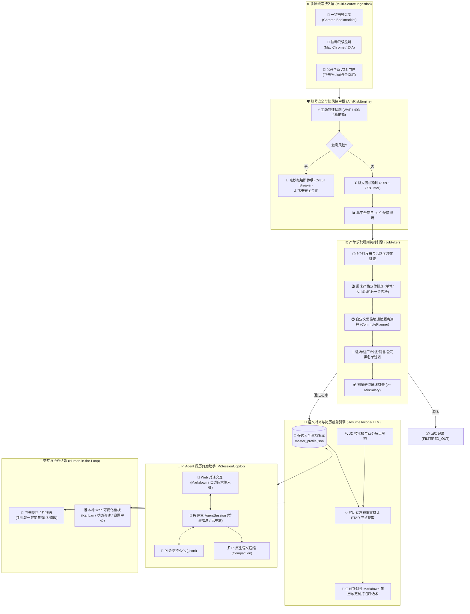

# 🎯 Job-Hunter OS (基于 Pi Agent 的全自动智能求职操作系统)

> 一款以 **Pi Coding Agent (`@earendil-works/pi-coding-agent`)** 为会话核心底座、具备**零封号风险控制引擎**、**周末双休与通勤多维严苛初筛**、**按目标 JD 动态裁剪简历与打招呼话术**、并通过**飞书交互卡片与本地现代 Web 看板**驱动的下一代自主求职协作操作系统。

---

## 🏗️ 系统全景架构图 (Architecture Overview)



---

## 🌟 核心特性与设计哲学

### 1. 🛡️ 零封号安全盾牌（Passive & AntiRiskEngine）
* **100% 纯只读与被动模式**：彻底移除任何驱动浏览器跳转 URL、高频模拟点击等触发平台 WAF 的激进行为；
* **主动熔断保护（Circuit Breaker）**：遇到验证码或频率限制，系统毫秒级切断抓取动作并推送休眠通知，绝不与反爬硬碰硬；
* **拟人随机延时与配额控制**：每一步处理强制加入 3.5s ~ 7.5s 随机非匀速停顿，单平台单日限制处理 20 个岗位，防止平台大数据标记。

### 2. ⚖️ 严苛求职红线把关（JobFilter）
* **周末严格双休**：单休、大小周、排班轮休一票否决；
* **岗位时效性审查**：仅处理近 3 个月（90天）内活跃发布的真实职位，拦截陈年僵尸岗位；
* **个性化通勤路线规划**：支持自定义常住地起点（如某某地铁站），自动估算公共交通耗时，超标直接否决；
* **负面场景黑名单**：驻场/驻厂/常驻客户现场/外派异地直接淘汰，支持企业黑名单动态排除。

### 3. 🧠 Pi Coding Agent 原生履历合伙人（Profile Copilot）
* **基于 `@earendil-works/pi-coding-agent` 原生底座**：
  * **增量推进（No Replay）**：告别传统应用将整段历史数组重复重放给大模型的低效做法，利用 Pi 原生 `session.prompt()` 纯增量推进；
  * **会话持久化与分支追溯**：历史对话直接存入 Pi 原生 `.jsonl` 树状结构，随开随续；
  * **语义智能压缩（Compaction）**：长对话自动浓缩精炼关键事实，降低 Token 消耗并规避长上下文遗忘；
* **100% 严格事实依从（Strict Grounding）**：深度绑定个人主履历库，严禁大模型凭空捏造未任职过的第三方机构或虚假战绩。

### 4. 🌍 完全解耦、开箱即用（Zero Hardcoding）
* 没有任何写死的人名、经历、公司或城市，所有行为完全由 `master_profile.json` 与 `rules.json` 动态驱动；
* 任何人克隆代码库，填入自己的履历与期望即可独立运行。

---

## 🚀 快速上手指南

### 1. 克隆项目与安装依赖

```bash
git clone https://github.com/Feng-H/job-hunter-agent.git
cd job-hunter-agent

# 安装依赖
npm install
```

### 2. 初始化个人配置

从模板复制并编辑您的专属配置：

```bash
# 复制环境变量模板（配置大模型与飞书）
cp .env.example .env

# 复制个人求职偏好模板（配置城市、常住地、通勤上限与薪资）
cp data/preferences/rules.example.json data/preferences/rules.json

# 复制个人全量主档案模板（填入您真实的技能与经历）
cp data/profile/master_profile.example.json data/profile/master_profile.json
```

* **`.env`**：填入兼容 OpenAI 规范的 API Key（支持 DeepSeek / Claude / Qwen / GLM 等）与飞书 Webhook；
* **`data/profile/master_profile.json`**：填入个人真实履历（姓名、经历、项目亮点、技能栈）；
* **`data/preferences/rules.json`**：配置目标城市、常住通勤起点、薪资下限。

### 3. 一键启动服务

```bash
# 赋予脚本执行权限
chmod +x job-hunter.sh

# 启动 Job-Hunter OS
./job-hunter.sh start
```

启动完成后，打开浏览器访问：
👉 **本地 Web 工作台**: **[http://127.0.0.1:8765](http://127.0.0.1:8765)**

#### 快捷运维管理命令：
```bash
./job-hunter.sh status   # 查看服务运行状态
./job-hunter.sh logs     # 实时查看系统运行日志
./job-hunter.sh stop     # 停止后台服务
./job-hunter.sh restart  # 重启服务
```

---

## 🖥️ 核心功能模块与使用说明

### 1. 现代化求职看板（Kanban Board）
* 状态泳道清晰划分为：**待人工审批（Pending）** ➔ **同意投递（Approved）** ➔ **沟通中（Applied）** ➔ **初筛淘汰（Filtered Out）**；
* 点击卡片右侧滑出抽屉，可查看 **针对该岗位裁剪的定制 Markdown 简历**、**HR 打招呼高转化话术**、**通勤换乘明细**及**初筛得分与原因**。

### 2. 👤 全量档案库与 AI 履历打磨助手
* **左侧可视化卡片**：直观展示当前系统加载的个人全量履历，支持切换 JSON 源码直接修改；
* **右侧 AI 打磨对话框**：
  * 支持 Markdown 优雅渲染与多行自适应输入；
  * 按 `Enter` 快捷发送，`Shift + Enter` 换行；
  * 右上角配备 **`[🗜️ 压缩记忆]`** 与 **`[🗑️ 新会话]`** 控制按钮。

### 3. 📌 一键书签采集工具（Bookmarklet）
* 打开 **[http://127.0.0.1:8765/setup](http://127.0.0.1:8765/setup)**；
* 将蓝色按钮拖拽到 Chrome 书签栏；
* 在 Boss直聘、猎聘、智联等网站浏览搜索时，点击书签，当前页面的所有岗位即可无缝送入 Agent 自动完成初筛与飞书推送！

---

## 🔒 隐私与开源安全规范

- 本项目的 `.gitignore` 已配置严格的数据隔离策略：
  * **自动忽略**：用户的真实履历（`master_profile.json`）、偏好设置（`rules.json`）、生成简历快照（`data/resumes_tailored/`）、历史聊天记忆（`data/memory/`）、本地日志（`logs/`）以及所有敏感的 `*.pdf` 文件；
  * 代码库中仅保留 `*.example.json` 作为标准演示模板，有效杜绝隐私泄露风险。

---

## 📄 开源许可证

本项目基于 [MIT License](LICENSE) 开源。
